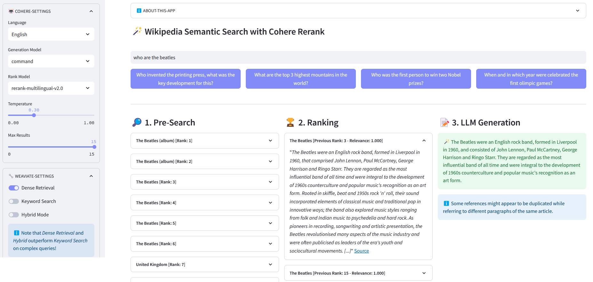

[](https://wikisearch.streamlit.app/)
[](https://www.python.org/)
[](https://www.codefactor.io/repository/github/dcarpintero/wikisearch)
[](https://github.com/dcarpintero/st-newsapi-connector/blob/main/LICENSE)

# 📚 Wikipedia Semantic Search with Reranking

<p align="center">
  
</p>

Streamlit App for **Multilingual Semantic Search** on over 10 million Wikipedia documents vectorized in embeddings by [Weaviate](https://weaviate.io/blog/semantic-search-with-wikipedia-and-weaviate). This implementation is based on [Cohere´s blog ´Using LLMs for Search´](https://txt.cohere.com/using-llms-for-search/) and its corresponding [notebook](https://colab.research.google.com/github/cohere-ai/notebooks/blob/main/notebooks/End_To_End_Wikipedia_Search.ipynb). It enables to compare the performance of *keyword search*, *dense retrieval* and *hybrid search* to query the Wikipedia dataset. It further demonstrates the use of [Cohere Rerank](https://txt.cohere.com/rerank/) to improve the accuracy of results, and [Cohere Generate](https://txt.cohere.com/generative-ai-part-3/) to provide a reponse based on said ranked results. 

> *Semantic search refers to search algorithms that consider the intent and contextual meaning of search phrases when generating results, rather than solely focusing on keyword matching. It provides more accurate and relevant results by understanding the semantics, or meaning, behind the query.*

> *An embedding is a vector (list) of floating point numbers representing data such as words, sentences, documents, images or audio. Said numerical representation captures the context, hierarchy and similarity of the data. They can be used for downstream tasks such as classification, clustering, outlier detection and semantic search.*

> *Vector databases, such as Weaviate, are purpose-built to optimize storage and querying capabilities for embeddings. In practice, a vector database uses a combination of different algorithms that all participate in Approximate Nearest Neighbor (ANN) search. These algorithms optimize the search through hashing, quantization, or graph-based search.*

# 📋 How does it work?

- **Pre-Search**: Pre-Search on Wikipedia embeddings with *keyword matching*, *dense retrieval* or *hybrid search*:

[Keyword Matching](https://weaviate.io/developers/weaviate/search/bm25/): it looks for objects that contain the search terms in their properties. The results are scored according to the [BM25F function](https://en.wikipedia.org/wiki/Okapi_BM25):

```python
    def with_bm25(self, query, lang='en', top_n=10) -> list:
        """
        Performs a keyword search (sparse retrieval) on Wikipedia Articles using embeddings stored in Weaviate.

        Parameters:
        - query (str): The search query.
        - lang (str, optional): The language of the articles. Default is 'en'.
        - top_n (int, optional): The number of top results to return. Default is 10.

        Returns:
        - list: List of top articles based on BM25F scoring.
        """
        logging.info("with_bm25()")
        where_filter = {
            "path": ["lang"],
            "operator": "Equal",
            "valueString": lang
        }
        response = (
            self.weaviate.query.get("Articles", self.WIKIPEDIA_PROPERTIES)
            .with_bm25(query=query)
            .with_where(where_filter)
            .with_limit(top_n)
            .do()
        )
        return response["data"]["Get"]["Articles"]
```

[Dense Retrieval](https://weaviate.io/developers/weaviate/search/similarity): find objects most similar to a raw (un-vectorized) text:

```python
    def with_neartext(self, query, lang='en', top_n=10) -> list:
        """
        Performs a semantic search (dense retrieval) on Wikipedia Articles using embeddings stored in Weaviate.

        Parameters:
        - query (str): The search query.
        - lang (str, optional): The language of the articles. Default is 'en'.
        - top_n (int, optional): The number of top results to return. Default is 10.

        Returns:
        - list: List of top articles based on semantic similarity.
        """
        logging.info("with_neartext()")
        nearText = {
            "concepts": [query]
        }
        where_filter = {
            "path": ["lang"],
            "operator": "Equal",
            "valueString": lang
        }
        response = (
            self.weaviate.query.get("Articles", self.WIKIPEDIA_PROPERTIES)
            .with_near_text(nearText)
            .with_where(where_filter)
            .with_limit(top_n)
            .do()
        )
        return response['data']['Get']['Articles']

```

[Hybrid Search](https://weaviate.io/developers/weaviate/search/hybrid/): produces results based on a weighted combination of results from a keyword (bm25) search and a vector search.

```python
    def with_hybrid(self, query, lang='en', top_n=10) -> list:
        """
        Performs a hybrid search on Wikipedia Articles using embeddings stored in Weaviate.

        Parameters:
        - query (str): The search query.
        - lang (str, optional): The language of the articles. Default is 'en'.
        - top_n (int, optional): The number of top results to return. Default is 10.

        Returns:
        - list: List of top articles based on hybrid scoring.
        """	
        logging.info("with_hybrid()")
        where_filter = {
            "path": ["lang"],
            "operator": "Equal",
            "valueString": lang
        }
        response = (
            self.weaviate.query.get("Articles", self.WIKIPEDIA_PROPERTIES)
            .with_hybrid(query=query)
            .with_where(where_filter)
            .with_limit(top_n)
            .do()
        )
        return response["data"]["Get"]["Articles"]
```

- **ReRank**:  [Cohere Rerank](https://txt.cohere.com/rerank/) re-organizes the Pre-Search by assigning a relevance score to each Pre-Search result given a user's query. Compared to embedding-based semantic search, it yields better search results — especially for complex and domain-specific queries.

<p align="center">
  
  Source: Cohere
</p>

```python
    def rerank(self, query, documents, top_n=10, model='rerank-english-v2.0') -> dict:
        """
        Reranks a list of responses using Cohere's reranking API.

        Parameters:
        - query (str): The search query.
        - documents (list): List of documents to be reranked.
        - top_n (int, optional): The number of top reranked results to return. Default is 10.
        - model: The model to use for reranking. Default is 'rerank-english-v2.0'.

        Returns:
        - dict: Reranked documents from Cohere's API.
        """
        return self.cohere.rerank(query=query, documents=documents, top_n=top_n, model=model)
```

- **Answer Generation**: [Cohere Generate](https://txt.cohere.com/generative-ai-part-3/) composes a response based on the ranked results.

```python
    def with_llm(self, context, query, temperature=0.2, model="command", lang="english") -> list:
        prompt = f"""
            Use the information provided below to answer the questions at the end. /
            Include some curious or relevant facts extracted from the context. /
            Generate the answer in the language of the query. If you cannot determine the language of the query use {lang}. /
            If the answer to the question is not contained in the provided information, generate "The answer is not in the context".
            ---
            Context information:
            {context}
            ---
            Question: 
            {query}
            """
        return self.cohere.generate(
            prompt=prompt,
            num_generations=1,
            max_tokens=1000,
            temperature=temperature,
            model=model,
            )
```

## 🚀 Quickstart

1. Clone the repository:
```
git@github.com:dcarpintero/wikisearch.git
```

2. Create and Activate a Virtual Environment:

```
Windows:

py -m venv .venv
.venv\scripts\activate

macOS/Linux

python3 -m venv .venv
source .venv/bin/activate
```

3. Install dependencies:

```
pip install -r requirements.txt
```

4. Launch Web Application

```
streamlit run ./app.py
```

## 👩‍💻 Streamlit Web App

Demo Web App deployed to [Streamlit Cloud](https://streamlit.io/cloud/) and available at https://wikisearch.streamlit.app/ 

# References
- [Cohere Rerank](https://txt.cohere.com/rerank/)
- [Streamlit Cloud](https://docs.streamlit.io/streamlit-community-cloud/get-started/)
- [The Embedding Archives: Millions of Wikipedia Article Embeddings in Many Languages](https://txt.cohere.com/embedding-archives-wikipedia/)
- [Using LLMs for Search with Dense Retrieval and Reranking](https://txt.cohere.com/using-llms-for-search/)
- [Vector Databases](https://www.pinecone.io/learn/vector-database/)
- [Weaviate Vector Search](https://weaviate.io/developers/weaviate/search/similarity/)
- [Weaviate BM25 Search](https://weaviate.io/developers/weaviate/search/bm25/)
- [Weaviate Hybrid Search](https://weaviate.io/developers/weaviate/search/hybrid/)
